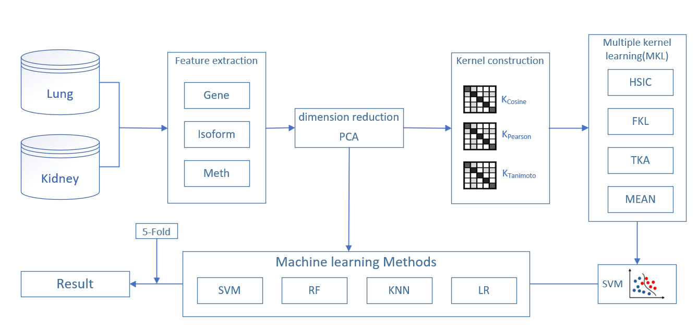

# Classification-of-lung-cancer-and-renal-cell-carcinoma
&nbsp;&nbsp;&nbsp;&nbsp;&nbsp;&nbsp;&nbsp;In recent years, cancer has become a serious threat to human health one of the diseases.If we can accurately identify the subtypes of cancer, it will provide great help for the follow-up treatment of patients. In this paper, we obtain three feature data sets of lung cancer and renal cancer from the Broad GDAC, which collects and analyzes the standardized data extracted from TCGA. Because the dimension of the feature data is too large, we use PCA method to reduce the dimension, so as to eliminate the redundant and useless features, and accelerate the operation speed of the classification model. By multiple kernel learning (MKL) method(Using TKA, fkl, HSIC, mean to calculate the weight of kernel fusion ) to calculate the combined kernel function, put it into SVM, and get excellent results. 
&nbsp;&nbsp;&nbsp;&nbsp;&nbsp;&nbsp;&nbsp; The study's flow chart as follows

